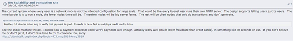
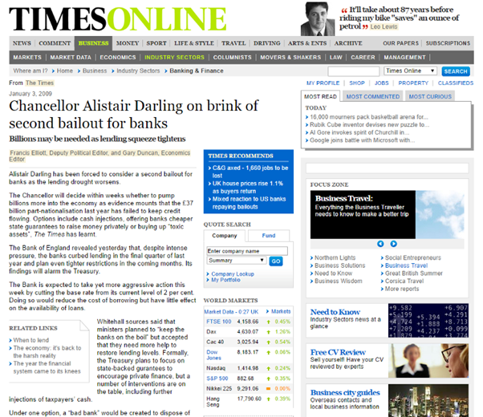
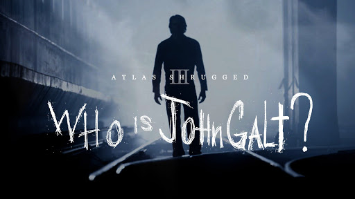

# 黑镜

原文： https://medium.com/@craig_10243/black-mirror-fb2457166a3d

比特币之所以作为一种工作量证明系统的被创造出来，某些原因可以在连续剧[“黑镜”](https://www.imdb.com/title/tt2085059/?ref_=tt_ov_inf)中的一集 ——[“急转直下”](https://www.imdb.com/title/tt5497778/) 里找到。在比特币成长的过程中，其价值还不足以吸引真正的企业矿工。第一个出现的比特币企业矿工是[CoinGeek](https://coingeek.com/)。（我提到的“企业矿工”，是指明显的私人企业，并使用自己的算力挖矿，而不是个体矿工或者小矿工组成的矿池）。它们投资基础设施，而不是在货币之间赌博和投机，它们的目标是建立开创新纪元的全球货币系统，这也是比特币一直以来的目标。

其它实体（例如SBI）将会跟随CoinGeek的带领。很多人不明白这些事情的重要性。比特币系统在[设计时就是为了最终达到数据中心的规模](https://bitcointalk.org/index.php?topic=532.msg6306#msg6306)，并且企业之间相互竞争。目标是创造第一个永恒不变的钱。这种稳定性，是创造长期合约的必要条件，其将赋予比特币成为稳定的全球货币的能力。

*比特币旨在成为企业系统*

在“黑镜”中的“急转直下”这一集中，主角在一个基于社交信用的世界里寻求接纳。在比特币的价值足够吸引企业矿工之前，第一阶段的开发工作被证明是类似于我所说的社交媒体证明 （PoSM）的。

*政治的社会属性导致法币不稳定*

它的开始是基于一个古老的心理欺骗的伪攻击。类似UASF的技术并没有技术优势，而是通过社交媒体证明来行动的。这种攻击在过去之所以是可行的，是因为比特币的系统的分布式属性。在总奖励高到足够吸引一个企业矿工之前，系统是基于一个分布式矿池系统的。这些矿池是很多小矿工组成的集体，大约有超过 150,000 个矿工和各种矿池相联系。

小矿工很容易被社交媒体动摇。开发者和其他人通过类似于 Reddit 和 Twitter 的社交媒体来散播恐惧、不确定性和怀疑（FUD），而小矿工们没有足够的资源来确切地调查许多错误的主张。为什么企业矿工的出现非常重要，这就是原因之一。

这种在比特币早期对其进行攻击的手法，类似于股权证明(PoS) 中的[寡头攻击](https://nchain.com/app/uploads/2017/07/PoW-and-the-firm.pdf)。

查明错误主张的成本，超出了许多小的挖矿机构的承受范围。但没有超出大型集团的承受范围，当这些大型集团开始竞争，我们将会看到更专业和稳定的货币开始出现。这些大型专业矿工将会开始为长期的投资而竞争，而不是在各种加密货币之间切换。

这也是美国国父们创建代议民主制的原因。他们预见到了有人可以煽动民心，使得民主系统被短期利益所颠覆。这种情况已经在美国出现，并且越来越多的煽动者使得系统变得不再民主。

社交媒体证明的攻击方式是使用错误的信息来迷惑矿工，使他们为了短期利益而采纳那些实验性的修改，即使人们已经知道其存在问题。在 CLTV 和 CSV 引入的时候我们就看到了这种情形。这些 opcodes 被核心开发者认定为是危险的，对比特币有害的，然而同样是这些开发者，重命名了这些提议，并实现了这些 opcodes，为的是在引入闪电网络的时候毁掉比特币：

>[我们不能安全地使用 OP_BLOCKNUMBER. 在区块链分裂后的重组过程中，交易需要能够被放到之后的区块里。OP_BLOCKNUMER 交易以及之后所有依赖它的交易都会变为非法的。这对于之后的比特币持有者来说是不公平的，他并没有参与这个包含时限的交易](https://bitcointalk.org/index.php?topic=46429.5;imode)。

OP_BlockNumber 是 OP_CLTV 的另一形式，此前已经被 Satoshi 拒绝了，并且所有核心开发者都承认其会给比特币带来漏洞。在人们忘记了这些漏洞之后，这些 opcodes 被引入了。

# 时代杂志

人们对于创世区块中援引的文章存在误解。引用那篇文章，和银行无关，和蛊惑人心有关。在民主系统中，政府的问题在于，我们允许政治家根据政见和时尚来修改我们的货币系统。在很多方面，这类似于我们在早先看到的，对于比特币的社交媒体攻击。法币可能会受到官僚和政治家的突发奇想所影响。这将不稳定性引入了一个周期性失败的系统中。政客和官僚试图通过对货币的短期操控来支撑他们的政见，所有这些导致了长期的失败，如果政府能够远离经济，我们本应该得到一个增长迅速得多的系统。

*这不是银行的问题，而是政治操纵金钱的问题*

在这篇时代杂志的文章中，我们看到政府是如何计划使用纳税人的钱，来“保持银行运转”。

犬儒主义哲学家第欧根尼证明了仅依靠社会共识和人群信仰的谬论。有一个故事，第欧根尼拜访了 Delphi 城的先知，对方指示他去“抹平货币”。为了达到这个目标，他在挑战现有习俗和价值观的基础上寻求生活。在过去的几年中，我在公众场合走过了类似的道路。我创造了一个公众角色，旨在以一种方式来进行挑战，即让某些人提出问题，而另一些人基于仅仅是对社交网络的看法来进行攻击。

我已经实现了这一点，因此结果将再次改变。

我在教学中的本质一直是苏格拉底式的。 我不直接回答问题，而是寻求其他人质疑，询问和测试他们自己，以一种走向理解和更深入知识的方式。 这使许多人疏远了，但这些人并不重要，重要的是少数能够沿着通向知识的道路前进的人。

*愤世嫉俗的第奥根尼在社会习俗中看到了愚蠢*

金钱，当被交给政府和官僚，在法定指令的控制下成为吸引选票的工具，并受到时尚的影响。 它成为政治权力的简单衡量标准，通过货币贬值，牺牲长期收益和增长来实现短期政治目标。

创世区块中引用的“泰晤士报”中的文章，并不涉及银行或政府的破坏。 引用它的目的是指出政治和社会对金钱的操纵。 在规模上，比特币被设计成一个不容易贬值的系统。 这就是为什么它可以被信任的原因。 超过20年依然相同，这种货币就可以被信任。 一旦游戏开始规则无法改变，就像刻在石头上一样。 比特币被设计成稳定的货币。 这是一个系统，预见到社会共识的危险，以及通过社交媒体到来的攻击; 也就是“急转直下”那一集中出现的社会货币问题。

# Modem(调制解调器)

跟随第奥根尼的道路，我已经在社交媒体中尽可能地证明了，那些无关紧要的匿名者是愚蠢的。 如果适用于金钱，这是一个会走向腐败的危险系统。

在最近的一篇文章中，我做了一些看似错误的事情。 这是故意的，旨在捕捉那些试图通过社交言论证明我的错误的人。 最近我有几个这样的声明。

Modem 是调制器/解调器。 这个术语错误地附在DSL设备和其他实际上不是调制解调器的系统上。 传统营销使用的术语不正确，这是社会缺陷的一个方面。

许多人对 Modem 的本质的认识是错误的。当我在 ISP，OzEmail 工作时，在90年代初期成为了公司服务工程部门的负责人。那些不足以拥有2Mb租用线路的客户通常会使用绑定的 modem 服务。这不是大多数家庭用户会考虑的事情，在这种情况下，企业用户会将多条电话线连接成一条虚拟线路。
包含10个 modem 的设备（对于此用途中的正确复数是 modem 而不是 modems）将使单个连接能比在单个电话线上获得更高的速度。通过 POTS 连接到多个拨号链路的多个 modem 将被绑定， 以形成单个连接。使用绑定连接实现的聚合吞吐量接近于绑定链路的总带宽。这是一个文字游戏，因为许多人现在使用术语 modems，但技术上不正确，因为这些是绑定连接中包含的单个调制解调系统，这就是我的帖子的意图。以获取到社交网络的关注，并展示在没有充分考虑情景的情况下，直接得出结论，是多么错误。

# 阿西莫夫

在他的“基地”系列中，阿西莫夫谈到了未来的历史。 我们已经看到比特币社区内的许多人以及山寨币中的其他人在迫切地想要创建链下解决方案。 所有这些都失去了存有全球数据和网络模式的假名系统带来的好处。

尼采谈到了奴隶哲学和主人哲学之间的区别。 不幸的是，这些系统的性质已经被那些对社会主义控制感兴趣的人所歪曲。 尼采并没有寻求强者主宰弱者的制度。 他提出了一个强硬的行政管家或管理者制度，同时商业领袖通过他们的行动和工作提供指导。

很少有人知道我与澳大利亚的联合教会有过密切合作。 一段时间以来，我一直是一名牧师，并积极参与联合金融服务，在那里我作为教会组织银行业务的受托人工作了多年。

长老会教会是建立在大多数新教组织的职业道德上的。 许多人倾听社交媒体的虚假偶像崇拜的主要原因之一就是欺骗性的呐喊，“少做”。 尚未完成大学学习的人在（社交媒体）平台上走红，使人们认为不需要工作和努力就能获得成就。
这种虚假和欺骗性的主张的原因是寻求权力。 他们希望其他人减少工作，以便他们能够在不提供回报的情况下利用他人的努力，获得更多并交付更多。 比特币不是股权证明，而是形成了持久工作的系统。 这是Bitmain试图改变的很多东西之一。 在股权证明中，一旦你取得了成就，你就不需要继续努力做得更好。 比特币是红皇后游戏。 这允许有新人进入，并确保所有各方专注于开发扩容解决方案，发展比特币。 反过来说，股权证明恰恰相反; 它允许那些有权力和金钱的人保持控制而不用做任何事情。

它是一个稳定的资本主义制度，可以满足[亚当·斯密的道德情操理论（1759）](https://www.youtube.com/watch?v=DTDUzd6_6Vw)中详细列出的要求，以实现公平的资本主义制度，旨在实现增长并使更多的人能够摆脱贫困。

比特币必须通过这个成长阶段。 随着它的成熟，在这之后会有其他的战斗。 这只是第一次。 在这场最初的斗争中，我们看到它试图摆脱社会控制的束缚，就像[阿特拉斯一样耸耸肩](https://www.amazon.com/Atlas-Shrugged-Ayn-Rand/dp/0451191145)。

*只有付出努力，我们才能成长和发展*

我们将看到未来两年比特币的第一阶段将被巩固。 在此之后，六年和十年将标志着市场的根本变化。 在这些中，我们将看到比特币中的企业化带来的更强劲增长和发展。 全球性的竞争团体将会出现，每个都在寻求进一步控制越来越小的奖励，这种奖励只能通过交易增长来增加。 结果就是，越来越大的区块和超级竞争系统。

比特币是稳定的全球现金。 通过国际竞争，不是依赖小型个人用户和业余爱好节点，而是来自大型企业实体，我们将获得世界上第一个稳定货币的稳定性和稳固性。